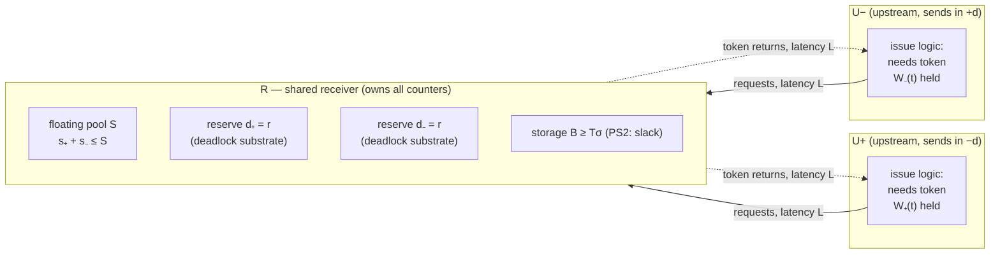
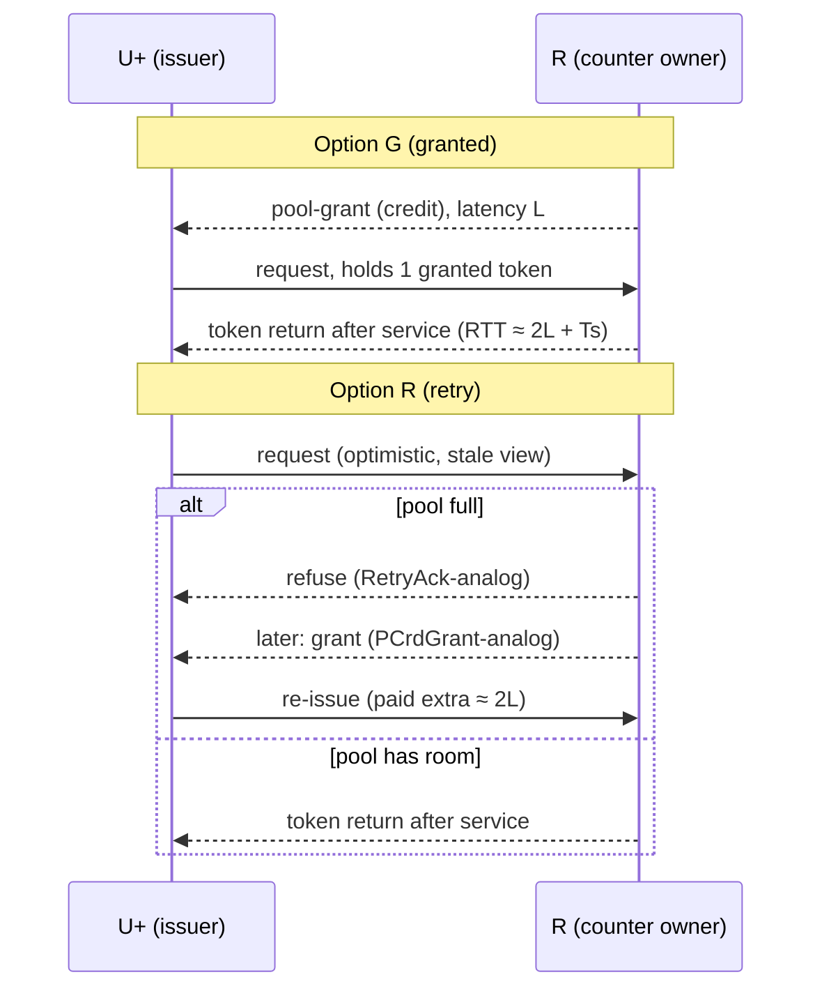

# DP in a Permission-Scarce Interface: Formal Definitions and Application Design

Date: 2026-08-29. Status: **definitions and design only** — benefit
hypotheses are stated as stubs (§7) and experiment details are
deliberately deferred to the next discussion.

Companion evidence:
`../physical_bound_research/README.md` (equal-physical null result,
1700 runs) and `../physical_bound_research/iface_digest.txt`
(adversarially verified interface survey; every grounding fact below
carries its provenance there).

---

## 0. Scope and claim discipline

This document does exactly three things:

1. formally defines the class of interfaces in which the *permission
   token* — not buffer storage — is the provisioned scarce resource
   (§1), and the space of token-split policies over a fixed budget
   (§2);
2. formally defines one concrete scenario in that class, the
   **Shared-Receiver Dimension Pair (SRDP)** (§3);
3. specifies how DP instantiates in SRDP (§4), including the two open
   synthesis options (§5) and a positioning table against verified
   industrial precedents (§6).

No performance claim is made anywhere in §1–§6. Claims appear only in
§7, marked as untested hypotheses.

---

## 1. Token-governed interfaces

### 1.1 Definitions

**Definition 1 (token-governed interface).** A token-governed
interface is a tuple

$$\mathcal{I} = (F,\; T,\; \sigma,\; B,\; C,\; \{RTT_f\})$$

where

| symbol | meaning |
|---|---|
| $F=\{1,\dots,n\}$ | flows sharing the interface |
| $T \in \mathbb{N}$ | total permission-token budget |
| $\sigma$ | max storage units pinned per held token |
| $B$ | physical storage at the receiver |
| $C$ | service capacity of the channel (requests per unit time) |
| $RTT_f$ | token round-trip time for flow $f$: consume-at-issue → return-at-completion |

subject to the **token discipline**:

- **(T1) issue rule** — flow $f$ may have a request outstanding only
  while holding a token;
- **(T2) return rule** — a token consumed at issue returns to the
  budget only when the request completes, i.e. after $RTT_f$;
- **(T3) conservation** — held + free $= T$ at all times.

Write $W_f(t)$ for the tokens held by flow $f$ at time $t$ (its
**window**), and $W_f^{\max}$ for the largest value the split policy
(§2) ever allows.

**Fact 1 (window law; Little).** In steady state,
$$X_f \;=\; \frac{\overline{W}_f}{RTT_f} \;\le\; \frac{W_f^{\max}}{RTT_f}.$$
Throughput is window-limited. Consequently **the token-split policy
*is* the bandwidth-allocation policy** of the interface.

**Definition 2 (permission-scarce).** $\mathcal{I}$ is
*permission-scarce* at an operating point iff both hold:

- **(PS1) scarcity** — the whole budget cannot fill the pipe:
  $$T \;<\; C \cdot RTT \qquad\text{(equivalently } T\sigma < \text{BDP in storage units)};$$
- **(PS2) storage slack** — any distribution of the $T$ tokens across
  $F$ can land in storage:
  $$B \;\ge\; T\,\sigma .$$

PS1 makes token allocation the *binding* constraint on throughput.
PS2 makes tokens **fungible** across flows (the precondition of
Proposition 1). An interface violating PS2 pins tokens to per-flow
storage; see Definition 5.

**Axiom 1 (cost asymmetry).** $\mathrm{cost}(T)$ is protocol-bounded
(on-wire counter/ID field width $w$ fixes $T \le 2^{w}$ per protocol
generation) or super-linear in circuits (CAM/tracker depth carries a
frequency cliff), while $\mathrm{cost}(B)$ is approximately linear
(SRAM). Hence $T$, not $B$, is the natural unit of "equal budget"
comparison in this class — the formal content of the claim that
*equal-commitment is the native comparison frame of this domain*.

### 1.2 Verified instances (grounding)

All rows verified in `iface_digest.txt` (per-claim provenance there).

| interface | token | budget $T$ (documented) | scarcity evidence (PS1) | slack / cost-asymmetry evidence |
|---|---|---|---|---|
| PCIe non-posted requests | Tag (+ per-type credits) | 32 (5-bit) → 256 (8-bit) → 768 (10-bit, 4.0) → 15,360 usable (14-bit, 6.0) | spec's own BW×RTT argument for each widening ("Tag availability … bottleneck") | Scaled FC added because 8/12-bit credit *fields* capped advertisable buffer (~32 KB) regardless of installed RX RAM |
| InfiniBand VL flow control | per-VL credit (64 B units) | 12-bit field ⇒ ≤ 2048 credits = 128 KB/VL | at 100 Gb/s, PS1 for any cable RTT > ~10.5 µs ⇒ ~1.05 km limit, independent of installed buffer (US 9,584,429) | buffer installable beyond advertisable window — the token field is the binding artifact |
| Arm CHI home node (CMN-700) | tracker entry, granted via RetryAck→PCrdGrant | POCQ 16–128 entries, default 32 | RetryAck issued while data arrays have space (static-form scarcity) | ">64 entries may have frequency implications" — Axiom 1 verbatim |
| Intel QPI/UPI link layer | flit credit (VNA) / packet credit (VN0) | per-link configured pools | VNA_CREDIT_CYCLES_OUT throttling event (credit-starved cycles) | VNA "shared adaptive buffered" vs VN0/VN1 reserved per class |

---

## 2. Split policies over a fixed budget

Fix $T$. A **split policy** $\pi$ decides who may hold how many
tokens.

**Definition 3 (static partition $\pi_{\mathrm{stat}}$).**
$T=\sum_f D_f$; invariant $W_f(t)\le D_f$ for all $t$.

**Definition 4 (pool + reserve
$\pi_{\mathrm{pool}}(\vec d, S, \vec{cap})$).**
$T=\sum_f d_f + S$. Let $s_f(t)$ = pool tokens held by $f$.
Invariants:

- **(P1)** $W_f(t) \le d_f + s_f(t)$;
- **(P2)** $\sum_f s_f(t) \le S$ (the *joint* pool constraint);
- **(P3)** $s_f(t) \le cap_f$ (optional per-flow usage cap);
- **(P4) reserve exemption** — the $d_f$ tokens are never lent:
  available to $f$ regardless of every $s_g$.

**Consumption order**: *shared-first* — acquire from the pool while
(P2)/(P3) permit, fall back to the reserve otherwise. (This is UPI's
documented order: "Requests first attempt to acquire a VNA credit,
and then fall back to VN0 if they fail.")

**Definition 5 (landing ceiling $H_f$).** The hard per-flow bound
imposed by any *second* resource a held token must occupy (per-flow
storage, per-flow physical lanes): $W_f(t)\le H_f$ always. Under PS2
with fully shared storage, $H_f = T$ (vacuous). Under per-flow
partitioned storage $B_f$: $H_f = B_f/\sigma$.

### 2.1 The upside proposition

Compare $\pi_{\mathrm{pool}}(\vec d, S)$ against its natural static
counterpart $\pi_{\mathrm{stat}}$ with $D_f = d_f + S/n$ (floating
tranche split evenly; weights generalize trivially).

**Proposition 1 (pooling upside).** Under single-hot-flow demand
($f$ backlogged, all $g \ne f$ idle), the window gain of pooling is

$$\mathrm{up}_f \;=\; \min(d_f + S,\; H_f)\;-\;\min\!\Big(d_f + \tfrac{S}{n},\; H_f\Big)\;\ge\;0,$$

and by Fact 1 the throughput gain is $\mathrm{up}_f / RTT_f$.
Two regimes:

- **(a)** $H_f \le d_f + S/n \;\Rightarrow\; \mathrm{up}_f = 0$ —
  pooling cannot help *any* demand pattern (the hot flow already hits
  its landing ceiling under the static split);
- **(b)** $H_f \ge d_f + S \;\Rightarrow\; \mathrm{up}_f = S(1-\tfrac1n)$
  — maximal; for $n=2$: half the pool.

**Corollary 1 (the equal-physical null result is structural).** In
the Garnet testbed, tokens are 1:1 pinned to per-inport VC slots:
per side, reserve $r$ and pooled physical slots $p$, so
$H_f = r + p$, while $S = 2p$ gives $D_f = d_f + S/2 = r + p = H_f$.
This is regime (a) with equality: $\mathrm{up}_f \equiv 0$ for every
flow and every demand, while any *binding* cap adds downside.
Measured confirmation: the 1700-run sweep found no capped cell above
plain anywhere (`physical_bound_research`, §4–§6). The null result is
a theorem of the substrate, not an empirical accident.

**Remark.** PS2 restores regime (b): $H_f = T \ge d_f + S$. This is
the precise sense in which *DP's floating split can only have value
in the permission domain*.

### 2.2 The three costs of pooling

**Definition 6 (pooling costs).** Relative to $\pi_{\mathrm{stat}}$
at equal $T$:

1. **reserve tax** — only the floating fraction is poolable:
   $S/T = 1 - \sum_f d_f / T < 1$; the reserves are the price of
   Definition 7.
2. **interference exposure** — the worst-case *guaranteed* window
   floor of $f$ under adversarial competitors:
   $$W_f^{\mathrm{floor}} \;=\; d_f + \max\Big(0,\; S - \sum_{g\ne f} cap_g\Big),$$
   which degenerates to $W_f^{\mathrm{floor}} = d_f$ when no caps are
   set ($cap_g = S$). Per-flow caps are precisely the industrial
   anti-hogging instrument (Omni-Path `Shared_Usage_Limit[VL]`,
   CMN-700 `max_allowed`).
3. **accounting cost** — the pool state $(s_f)$ is shared mutable
   state between spatially separated issuers; any hardware synthesis
   pays either grant latency or retry round-trips, plus a staleness
   window $\Delta$ (§5).

**Definition 7 (forward-progress condition).**
$\pi_{\mathrm{pool}}$ is *progress-safe* iff for every $f$:
$d_f \ge d_f^{\min} > 0$, **and** the reserve tranche is operated by
a protocol that returns reserve tokens in bounded time *independently
of pool state*. Then
$$X_f \;\ge\; \frac{d_f^{\min}}{RTT_f^{\max}} \;>\; 0$$
for **all** pool states — including a corrupted pool counter.
*Counter correctness-exemption* means exactly: the progress argument
never reads any $s_f$.

---

## 3. The scenario: Shared-Receiver Dimension Pair (SRDP)

### 3.1 Setting

Fix a dimension $d$ of a ring/torus. A downstream node $R$ (router,
D2D adapter, or home-node-like tracker owner) receives traffic from
its two upstream neighbors on opposite sides of the dimension:
$U_{+}$ over link $\ell_{+}$ and $U_{-}$ over link $\ell_{-}$, both
with one-way latency $L$ (long: off-die D2D, off-package, cable).

$R$ provisions, for the inport pair $\{+d, -d\}$:

- a **token budget** $T$ governing occupancy-at-$R$ (tracker entries
  / RX permits), with $T$ bounded by Axiom 1 (field width, CAM
  depth);
- **storage** $B \ge T\sigma$ shared across the pair — PS2 holds *by
  provisioning* (SRAM is the cheap side of Axiom 1);
- token loop $RTT \approx 2L + T_s$ ($T_s$ = service time), so PS1
  ($T < C\,(2L+T_s)$) is the plausible regime at long $L$.

Flows: $n = 2$, $f \in \{+d, -d\}$. The interface
$\mathcal{I}_{\mathrm{SRDP}} = (\{+d,-d\},\, T,\, \sigma,\, B,\, C,\, RTT)$
is permission-scarce by construction.



Budget layout ($T = 2r + S$):

```
        |<-- d₊ = r -->|<---------- S (floating) ---------->|<-- d₋ = r -->|
tokens: [ reserve, +d  |  held by +d ... free ... held by −d | reserve, −d ]
        exempt (P4)                joint cap (P2)              exempt (P4)
```

### 3.2 Why this pair (design rationale — DP's identity)

1. **Locality.** Both flows terminate at the *same* $R$, so the pool
   counter is a receiver-local object — no third party, no
   distributed agreement beyond the two grant loops.
2. **Anti-correlated demand.** Directional traffic (tornado-like
   phases, dimension-ordered routing phases) loads one direction of a
   dimension at a time; a floating budget tracks the hot direction at
   timescale $\Delta$ (§5).
3. **The empty cell.** Every verified counter-pool precedent pools
   across message classes / VCs / VLs *within one link or one
   tracker* (§6). SRDP pools across **two different upstream links**.
   No verified precedent occupies this cell.

---

## 4. DP instantiated in SRDP

**Definition 8 (DP-SRDP).** DP in the SRDP scenario is the policy
$\pi_{\mathrm{pool}}(d_{+}=d_{-}=r,\; S,\; \vec{cap}=\text{none})$
with:

- reserves $r$ per direction operated as a **deadlock substrate**
  (CBS bubble sub-ring or escape-VC network), satisfying
  Definition 7 by construction;
- shared-first consumption order;
- pool counter maintained at $R$, correctness-exempt (Def. 7's
  progress argument never reads it).

Mapping from the existing gem5-DP artifacts:

| gem5-DP construct | SRDP construct | institutionalized analog |
|---|---|---|
| pooled-VC joint occupancy budget $S$ (`--dp-shared-cap`) | floating token tranche $S$ at $R$ | UPI VNA · CMN-700 shared region · OPA `Global_Shared_Limit` |
| dedicated offsets $[0,r)$ per side (`--dp-reserve`) / exempt escape VCs | per-direction reserve $d_\pm = r$ running the deadlock substrate | UPI VN0 · CMN-700 dedicated entries · OPA `Dedicated_Limit[VL]` |
| shared-first VC scan | shared-first token acquisition | UPI "try VNA first, fall back to VN0" |
| joint cap only (P2), no per-flow cap | (P3) absent — **design question Q1** | `max_allowed` (CMN) · `Shared_Usage_Limit` (OPA) exist in all precedents |
| `m_dp_shared_occ` global registry (simulation oracle) | counters at $R$ + grant/return signaling — **design question Q2** | RetryAck/PCrdGrant (CHI) or credit channels (UPI/PCIe) |

**Delegation direction (the C-axis, made precise).** In the
precedents, the reserve guarantees *acceptance/no-retry* for each
class and the pool machinery still participates in the correctness
argument (e.g. FFC/BSFC counters *are* the deadlock mechanism). In
DP-SRDP, the reserve tranche is itself a complete deadlock-free
network; Definition 7 holds with the pool counter unread, so the
counter is a **deletable performance artifact**: setting $S=0$ or
corrupting $s_f$ degrades throughput, never correctness. This is
inherited from the BG/L dynamic-VC/escape-VC lineage and is what
permits the pool to span two links without a new safety proof.

---

## 5. Accounting synthesis: two open options (design question Q2)

The simulation oracle must become hardware. The pool state lives at
$R$; the issuers are at $U_\pm$, one $L$ away. Staleness
$\Delta \approx L$ is unavoidable; the options differ in who absorbs
it.

**Option G — receiver-granted pool credits.** $R$ pre-grants pool
tokens to $U_+$/$U_-$ over the reverse channels; $U$ issues only
against held grants.

- race-free by construction (grants are conserved objects);
- cost: a freed token reaches a *shifted* hot direction only after
  $\approx 2L$ (return + re-grant), so
  $S_{\mathrm{eff}} \le S - (\text{tokens in grant flight})$;
- $R$ needs a grant policy (demand hints piggybacked on requests,
  round-robin, or occupancy-proportional).

**Option R — optimistic issue + refusal/retry.** $U$ issues against
a local stale view; $R$ refuses when the pool is full
(RetryAck-analog) and grants later (PCrdGrant-analog).

- no idle pool when demand is steady;
- cost: each refusal costs the loser a $2L$ round-trip plus retry
  queue machinery at $R$; matches shipping CHI practice.



Hybrid (G for steady state + R for bursts) is a third point in the
space. **Decision deferred to discussion.**

---

## 6. Positioning against verified precedents

One row per verified family (`iface_digest.txt`); the last row is the
proposal.

| design | pooled unit | sharing scope | reserve semantics | per-flow cap | counter's correctness role |
|---|---|---|---|---|---|
| Intel UPI VNA/VN0 | flit credits | message classes, **one link** | VN0 per-class, deadlock prevention | — (pool itself bounded) | credit system is correctness-critical |
| CMN-700 POCQ | tracker entries | request classes, **one tracker** | per-class dedicated, no-retry/starvation-freedom | `max_allowed` per class | tracker accounting correctness-critical |
| Intel CPI (CXL) | link credits | VCs + protocols, **one link** | dedicated per-VC credits | — (shared-first recommended) | credit system correctness-critical |
| Omni-Path (US 9,385,962) | RX buffer credits | VLs, **one link** | `Dedicated_Limit[VL]`, FM-retunable | `Shared_Usage_Limit[VL]` | TX-side limits correctness-critical |
| FFC / BSFC | occupancy counters | **one output port / one downstream link** | — | — | counters **are** the deadlock mechanism (inverse of DP) |
| Fukase '17 / UBMR | physical buffer banks | two links, **physically merged datapath** | per-channel minimum private buffer | — | allocation machinery correctness-critical |
| **DP-SRDP (this doc)** | permission tokens | **two opposing upstream links, one receiver** | per-direction reserve = complete deadlock substrate | Q1 (open) | **correctness-exempt, deletable** |

The novelty residue is exactly the last row's three distinguishing cells:
cross-link spatial scope, substrate-as-reserve, exempt counter. The
accounting *pattern* (pool + reserve + shared-first) is deliberately
inherited, not claimed.

---

## 7. Deferred: hypotheses awaiting the next discussion

Stated for orientation only; **no experiment design is fixed here**.

- **H1 (asymmetry benefit).** At equal $T$ under one-sided demand,
  $\pi_{\mathrm{pool}}$ gains up to $S/2$ window over
  $\pi_{\mathrm{stat}}$ (Prop. 1(b)), i.e. throughput
  $+\,S/(2\,RTT)$; the gain should grow with $L$ (PS1 deepens) and
  vanish as demand symmetrizes.
- **H2 (cap as fairness governor).** Adding $cap_f$ (Q1) trades
  hot-direction throughput for the cold direction's floor
  (Def. 6.2); visible only in *per-direction* metrics, invisible in
  aggregate sweeps — which is consistent with, not contradicted by,
  the equal-physical null result.
- **H3 (staleness sensitivity).** The realized fraction of Prop. 1's
  upside degrades with $\Delta/RTT$; Options G and R degrade
  differently (idle-pool loss vs retry loss), giving a crossover to
  locate.

Garnet realizability note (one line, details deferred): PS1/PS2 can
be emulated with long link latency (existing topology parameter) plus
deliberately over-provisioned per-inport VCs, with the token budget
$T$ as the swept variable — i.e. the *equal-commitment* axis, now
formally licensed by Axiom 1 + PS2 instead of assumed.

---

## 8. Notation

| symbol | meaning | introduced |
|---|---|---|
| $F, n$ | flow set, its size ($n=2$ in SRDP) | Def. 1 |
| $T$ | total token budget | Def. 1 |
| $\sigma$ | storage pinned per held token | Def. 1 |
| $B$ | receiver storage | Def. 1 |
| $C$ | channel service capacity | Def. 1 |
| $RTT_f$ | token round-trip time | Def. 1 |
| $W_f(t)$ | window: tokens held by $f$ | Def. 1 |
| $X_f$ | throughput of $f$ | Fact 1 |
| PS1 / PS2 | scarcity / storage-slack conditions | Def. 2 |
| $D_f$ | static share | Def. 3 |
| $d_f,\; S,\; cap_f$ | reserve, floating pool, per-flow cap | Def. 4 |
| $s_f(t)$ | pool tokens held by $f$ | Def. 4 |
| $H_f$ | landing ceiling (second-resource bound) | Def. 5 |
| $\mathrm{up}_f$ | pooling window upside | Prop. 1 |
| $W_f^{\mathrm{floor}}$ | worst-case guaranteed window | Def. 6 |
| $r$ | per-direction reserve in DP-SRDP | Def. 8 |
| $L,\; \Delta,\; T_s$ | link latency, staleness, service time | §3, §5 |
