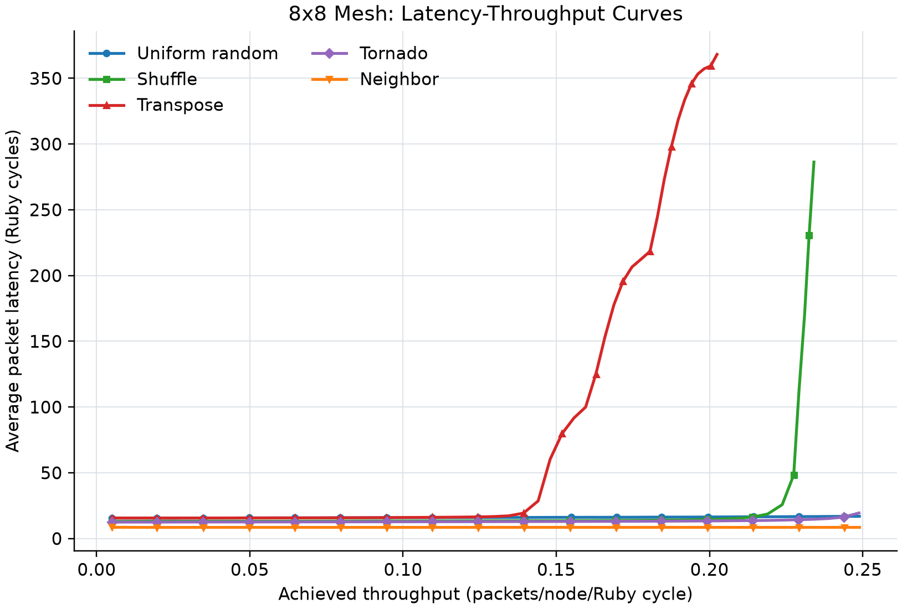
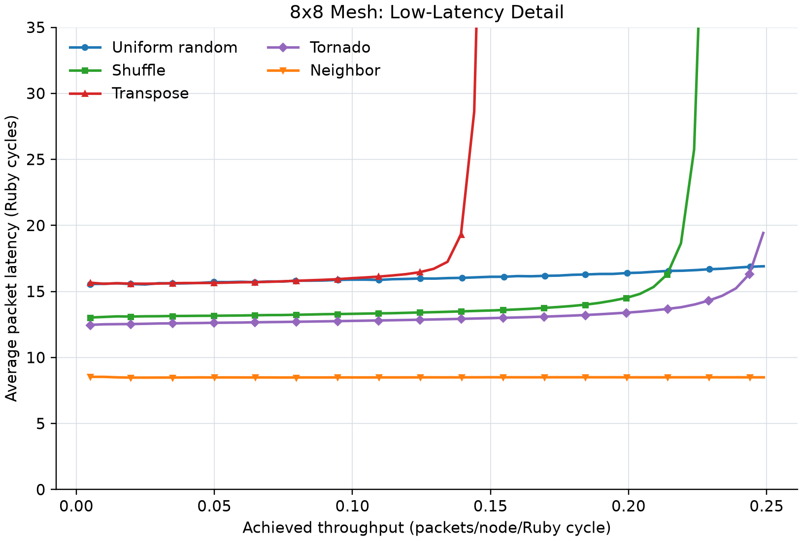
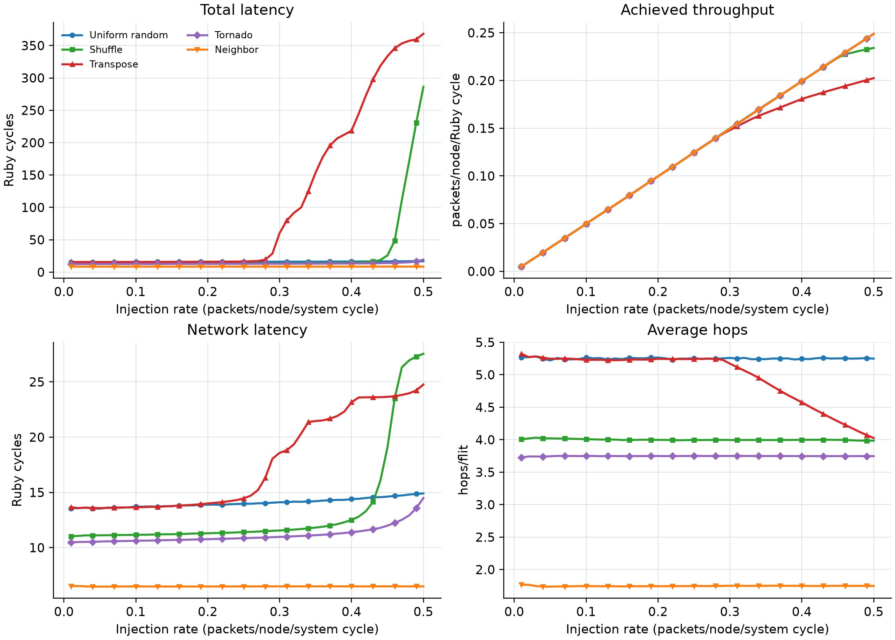

# Lab 2 Task 1 measured summary

The efficiency knee is the first injection rate where achieved throughput
falls below 90% of offered network load. The latency knee is the first
rate where total packet latency reaches twice its value at rate 0.01.

| Pattern | Low-load latency | Hops (measured/theory) | Peak throughput | Peak at rate | 90% knee | 2x latency |
|---|---:|---:|---:|---:|---:|---:|
| uniform_random | 15.558 | 5.269/5.250 | 0.248914 | 0.50 | not observed | not observed |
| shuffle | 13.025 | 4.006/4.000 | 0.234073 | 0.50 | not observed | 0.46 |
| transpose | 15.662 | 5.324/5.250 | 0.202458 | 0.50 | 0.41 | 0.30 |
| tornado | 12.469 | 3.726/3.750 | 0.248770 | 0.50 | not observed | not observed |
| neighbor | 8.531 | 1.766/1.750 | 0.248956 | 0.50 | not observed | not observed |

## Method

Each point uses a 64-node 8x8 Mesh_XY network, single-flit control
traffic on vnet 0, and a 10,000-Ruby-cycle measurement window. The
tester runs at 1 GHz and Ruby at 2 GHz. Therefore an injection rate
of 0.50 corresponds to an offered load of 0.25 packets/node/Ruby cycle.
Achieved throughput is received packets / (64 nodes x 10,000 Ruby cycles).

## Low-load latency and hop count

At injection rate 0.01, the latency ranking is Neighbor (8.53) < Tornado (12.47) < Shuffle (13.03) < Uniform random (15.56) < Transpose (15.66) Ruby cycles. The ranking follows path length: neighbor is local to an
adjacent node, tornado has short bounded offsets, shuffle averages four
hops, and uniform random and transpose both average about 5.25 hops.
The measurements closely match the exact theoretical hop counts in the
table. At low load, queueing latency is 2 cycles for every pattern, and
the measured total latency is approximately 5 + 2 x average_hops.

## Throughput and saturation

At rate 0.50, uniform random, tornado, and neighbor deliver 0.249, 0.249, and 0.249 packets/node/Ruby cycle. All are close to the offered load of 0.25, so their saturation points
were not reached in the requested sweep. Neighbor remains almost flat
because its one-hop traffic uses network resources very lightly.
Transpose reaches twice its low-load latency at rate 0.30 (60.35 cycles), then reaches only 0.202 throughput at rate 0.50. Shuffle's sharp latency knee occurs later, near rate 0.46 (48.38 cycles); its rate-0.50 throughput is 0.234. These permutation patterns
create persistent concentration on particular links, so they saturate
before spatially distributed uniform-random traffic.

## Latency composition

At rate 0.50, transpose spends 343.44 of 368.20 cycles in queues, while shuffle spends 258.78 of 286.33. Thus their rapid latency
growth is dominated by contention and waiting, not by a large increase
in the time needed to traverse an uncongested path.

## Interpreting hop count under overload

Transpose's reported average hops falls after congestion begins. XY
routing has not shortened the source-destination paths: the statistic
only includes flits that arrive during the finite simulation. Under
heavy congestion, long-path packets are more likely to remain in flight
at the end, biasing the completed-packet average downward.

