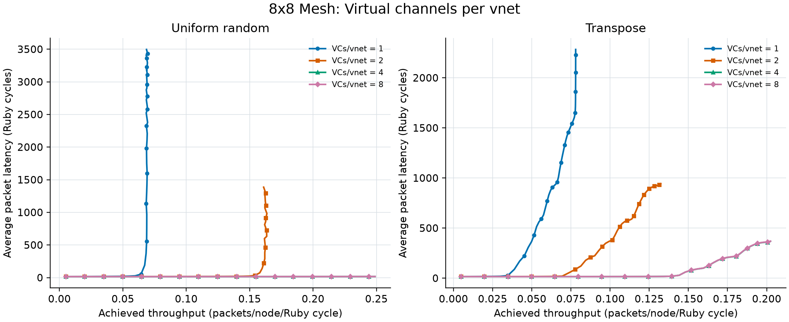
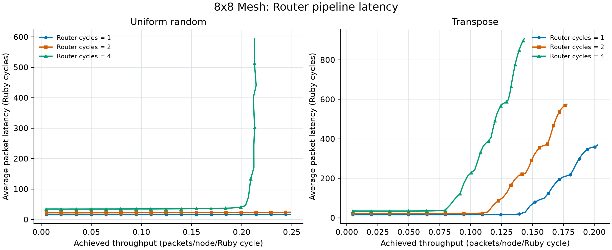
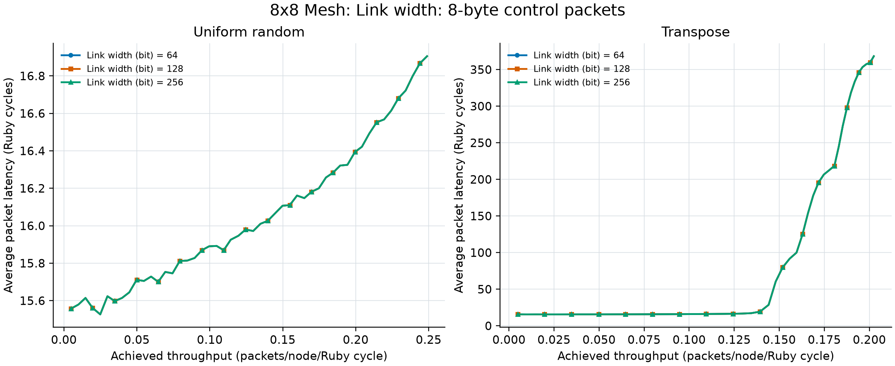
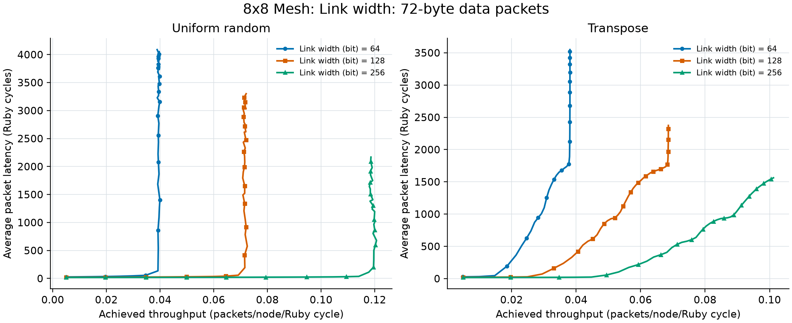

# Lab 2 Task 2 measured summary

All sweeps use a 64-node 8x8 Mesh_XY network and a 10,000-Ruby-cycle
measurement window. Uniform random represents distributed traffic and
transpose represents a deterministic hotspot-prone permutation.

| Experiment | Pattern | Value | Low-load latency | Max throughput | 2x latency rate | 90% efficiency rate |
|---|---|---:|---:|---:|---:|---:|
| vcs | uniform_random | 1 | 15.745 | 0.069517 | 0.13 | 0.16 |
| vcs | uniform_random | 2 | 15.560 | 0.163612 | 0.31 | 0.36 |
| vcs | uniform_random | 4 | 15.558 | 0.248914 | not observed | not observed |
| vcs | uniform_random | 8 | 15.558 | 0.248919 | not observed | not observed |
| vcs | transpose | 1 | 15.828 | 0.078033 | 0.08 | 0.11 |
| vcs | transpose | 2 | 15.666 | 0.132356 | 0.15 | 0.21 |
| vcs | transpose | 4 | 15.662 | 0.202458 | 0.30 | 0.41 |
| vcs | transpose | 8 | 15.662 | 0.202456 | 0.30 | 0.41 |
| router_latency | uniform_random | 1 | 15.558 | 0.248914 | not observed | not observed |
| router_latency | uniform_random | 2 | 21.819 | 0.248739 | not observed | not observed |
| router_latency | uniform_random | 4 | 34.348 | 0.214438 | 0.42 | 0.48 |
| router_latency | transpose | 1 | 15.662 | 0.202458 | 0.30 | 0.41 |
| router_latency | transpose | 2 | 21.978 | 0.177737 | 0.24 | 0.33 |
| router_latency | transpose | 4 | 34.616 | 0.143478 | 0.18 | 0.23 |
| link_width_control | uniform_random | 64 | 15.558 | 0.248914 | not observed | not observed |
| link_width_control | uniform_random | 128 | 15.558 | 0.248914 | not observed | not observed |
| link_width_control | uniform_random | 256 | 15.558 | 0.248914 | not observed | not observed |
| link_width_control | transpose | 64 | 15.662 | 0.202458 | 0.30 | 0.41 |
| link_width_control | transpose | 128 | 15.662 | 0.202458 | 0.30 | 0.41 |
| link_width_control | transpose | 256 | 15.662 | 0.202458 | 0.30 | 0.41 |
| link_width_data | uniform_random | 64 | 27.030 | 0.039938 | 0.07 | 0.09 |
| link_width_data | uniform_random | 128 | 20.906 | 0.072494 | 0.14 | 0.16 |
| link_width_data | uniform_random | 256 | 17.742 | 0.120655 | 0.23 | 0.27 |
| link_width_data | transpose | 64 | 27.474 | 0.038097 | 0.04 | 0.05 |
| link_width_data | transpose | 128 | 21.008 | 0.068611 | 0.06 | 0.09 |
| link_width_data | transpose | 256 | 17.816 | 0.101198 | 0.10 | 0.14 |

The 90% efficiency rate is the first injection rate where achieved
packet throughput falls below 90% of offered packet load. The 2x
latency rate is the first point whose latency is twice the rate-0.01
value. A missing value means the threshold was not reached by 0.50.

## Experimental method

Each sweep changes one parameter while retaining the default baseline:
4 VCs/vnet, 1-cycle routers, and 128-bit links. Rates 0.01 through
0.50 are tested in 0.01 increments. Vnet 0 supplies 8-byte single-flit
control packets for the VC and router experiments. Link width is tested
with both vnet-0 control packets and vnet-2 72-byte data packets.

## Virtual channels per vnet

For uniform random, maximum observed throughput rises from 0.070 with one VC to 0.164 with two and 0.249 with four. For transpose the corresponding values are 0.078, 0.132, and 0.202. Extra VCs reduce
head-of-line blocking and provide more independent one-flit buffers,
so links remain productive while another flow waits for credit.
Increasing from four to eight VCs changes peak throughput by only 0.000005 for uniform random and 0.000002 for transpose. At that point physical-link and traffic-placement
contention, rather than VC availability, is the limiting resource.

## Router latency

Uniform-random low-load latency increases from 15.56 to 21.82 and 34.35 cycles as router latency
changes from 1 to 2 and 4 cycles. Transpose shows the same increase:
15.66, 21.98, and 34.62. The increment is close
to (router_latency - 1) x (average_hops + 1), because a packet pays
the extra pipeline stages at every traversed router.
For transpose, the 2x-latency knee moves from injection rate 0.30 to 0.24 and 0.18. Longer pipelines also
delay credit return, so finite VC buffers recycle more slowly and
the hotspot-prone workload saturates earlier.

## Link width

All 64-, 128-, and 256-bit control-packet curves are exactly equal.
An 8-byte packet occupies one flit at every tested width, and a Garnet
link still transfers one flit per cycle; unused bits do not create a
second packet transfer in that cycle.
For 72-byte packets, 64-, 128-, and 256-bit links require 9, 5, and 3
flits per packet. Uniform-random maximum packet throughput therefore
increases from 0.040 to 0.072 and 0.121. Multiplying by the
respective flit counts gives approximately 0.359, 0.362, and 0.362
flits/node/cycle, confirming that the same network flit capacity is
being divided among fewer flits per packet on wider links.
Transpose also improves from 0.038 to 0.069 and 0.101, but remains below
uniform random because its deterministic paths concentrate load on a
smaller set of links.

## Conclusions

VC count mainly controls blocking and buffering, router latency directly
sets per-hop delay and credit round-trip time, and link width controls
packet serialization only when packets span multiple flits. Four VCs
are sufficient for these tested single-flit workloads; additional VCs
do not remove the physical bottleneck. Wider links are most valuable
for data traffic, while single-flit control traffic receives no benefit.

