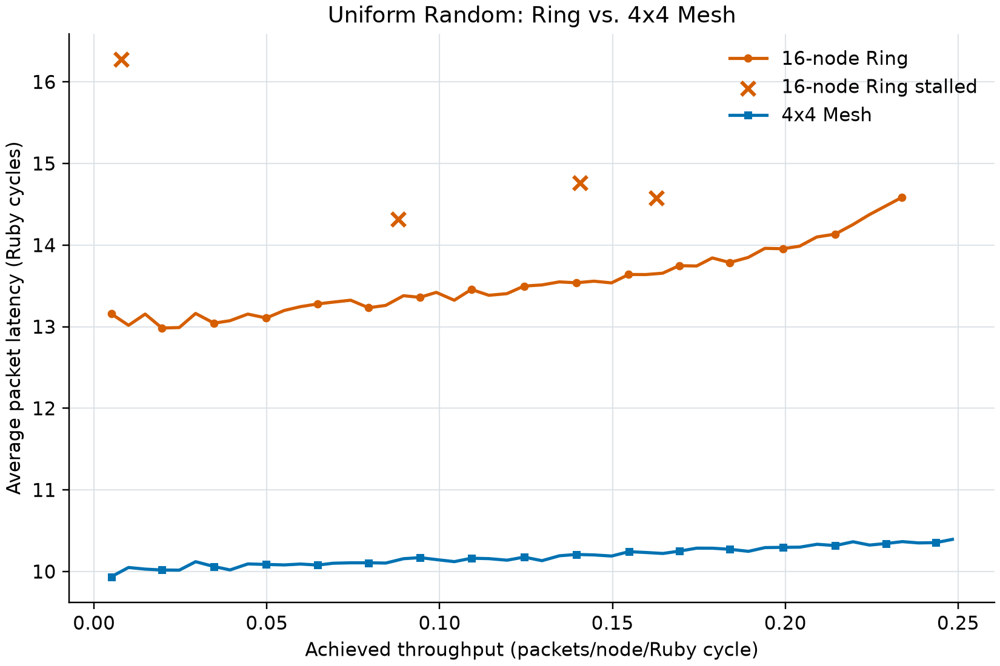
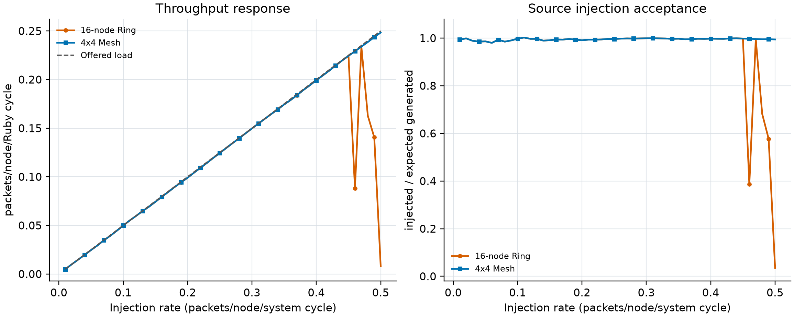

# Lab 3 Task 1 analysis

## Implementation and validation

`configs/topologies/Ring.py` creates 16 routers, 32 directed internal
links, and 32 controller-facing external links. Clockwise and
counterclockwise wraparound links connect routers 15 and 0. Custom
routing (`--routing-algorithm=2`) compares modular distance in both
directions and chooses the shorter path; an eight-hop tie goes clockwise.
Directed tests produced exactly 1, 1, 8, and 5 hops for routes 0->15,
15->0, 0->8, and 3->14.

## Low-load behavior

The Ring measures 4.072 average hops at rate 0.01 versus the exact uniform-random expectation of 4.0. The 4x4 Mesh
measures 2.465 versus 2.5. Corresponding
packet latencies are 13.158 and
9.936 Ruby cycles. The Ring is slower
because its degree-two topology has longer paths than the two-dimensional
Mesh.

## Throughput and cyclic dependency

The largest stable Ring throughput observed is 0.233756 packets/node/Ruby cycle at
injection rate 0.47. The first
stalled point is rate 0.46. At rate 0.50, only
0.035 of expected packets enter the
network, so received/injected alone would hide the source-side stall.
Minimal routing in each direction forms a cyclic channel-dependency graph
around the Ring. With finite one-flit control buffers and four VCs, a high
load can fill the cycle so every flit waits for downstream credit. This is
a routing-level deadlock hazard rather than an ordinary smooth saturation
point. Whether a finite run closes the dependency cycle depends on packet
timing, explaining why an isolated higher-rate point may complete after a
lower-rate point stalls. Strict deadlock freedom requires a dateline/escape-VC
scheme or
another mechanism that breaks the cyclic dependency.

