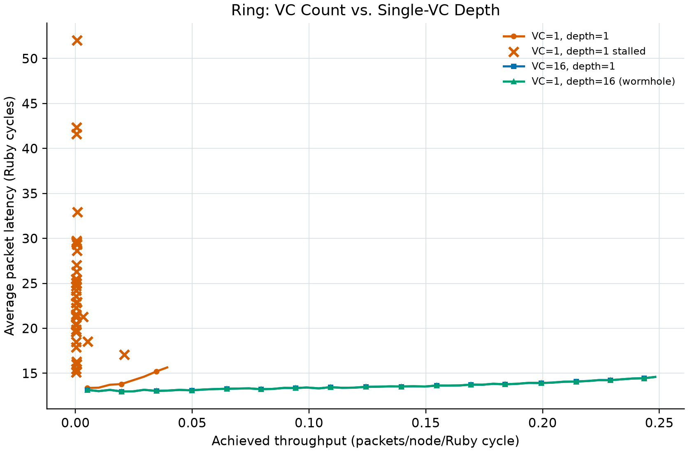
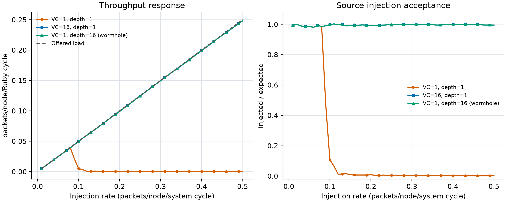

# Lab 3 Task 2 analysis

The experiment uses the 16-node Ring, uniform-random vnet-0 control
traffic, and a 10,000-Ruby-cycle window. Each point reports both
received throughput and source injection acceptance.

| Mode | Low-load latency | Max stable throughput | Max stable rate | First stalled rate |
|---|---:|---:|---:|---:|
| VC=1, depth=1 | 13.365 | 0.039288 | 0.08 | 0.09 |
| VC=16, depth=1 | 13.158 | 0.248237 | 0.50 | not observed |
| VC=1, depth=16 (wormhole) | 13.158 | 0.248250 | 0.50 | not observed |

VC=1/depth=1 has one credit slot and one packet ownership context.
It is the most sensitive to credit round-trip latency and head-of-line
blocking. VC=16/depth=1 provides the same total 16 slots as wormhole
but separates them into independent routing and arbitration contexts.
VC=1/depth=16 keeps one FIFO and one ownership context while allowing
sixteen outstanding single-flit packets to consume credits.

The physical link still transmits at most one flit per cycle in all three
cases. Improvements therefore come from better link utilization and
hiding credit latency, not from increased physical bandwidth. A deep single
VC can still suffer head-of-line blocking when its front packet requests a
busy output, while multiple VCs can select another ready packet.

At high Ring load, a drop in source acceptance indicates that packets are
stuck before injection or that a cyclic channel dependency has formed;
received/injected alone does not expose this condition. The Ring routing
algorithm remains susceptible to such cyclic dependencies, so the
wormhole comparison should be interpreted as buffer-utilization behavior
within the finite simulation window, not as a proof of deadlock freedom.

