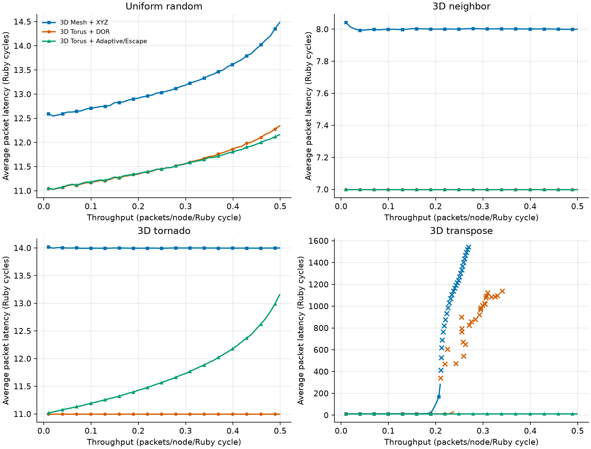
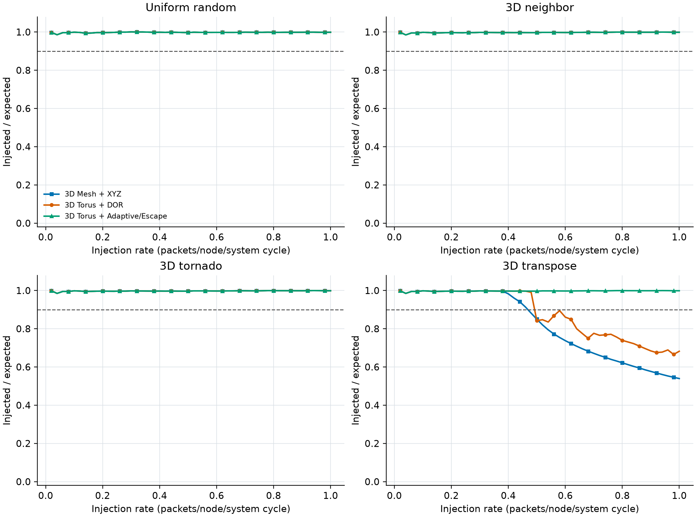
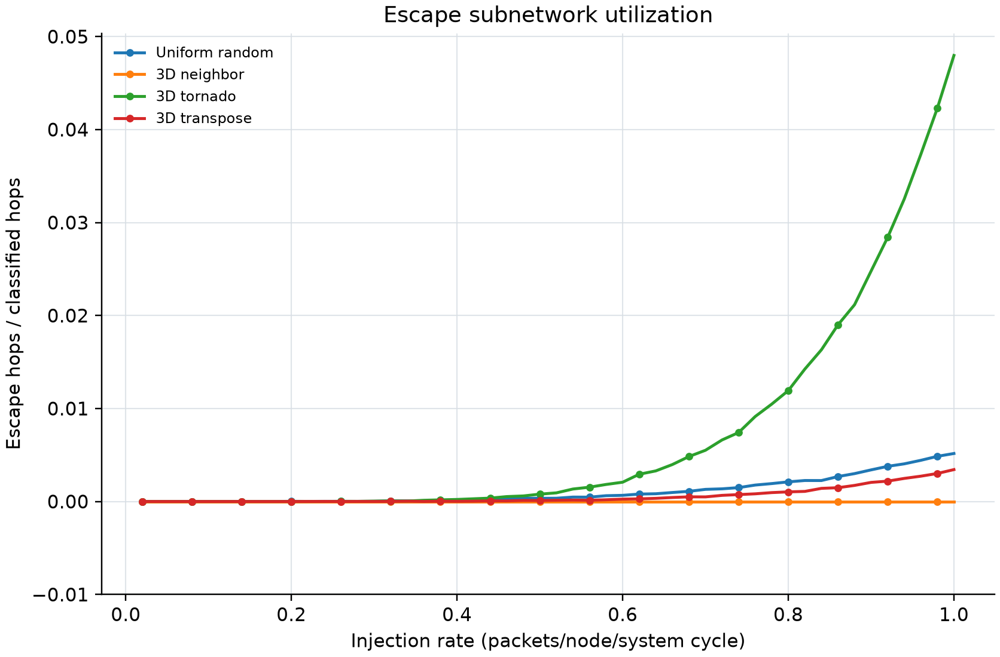

# Lab 4 measured analysis

The experiment uses 64 nodes, four VCs per vnet, single-flit
vnet-0 control traffic, and a 10,000-Ruby-cycle measurement window.
A point is classified as stalled when source injection acceptance
falls below 0.9.

| Pattern | Mode | Low-load latency | Hops | Max stable throughput | First stalled rate | Peak escape fraction |
|---|---|---:|---:|---:|---:|---:|
| Uniform random | 3D Mesh + XYZ | 12.595 | 3.786 | 0.498708 | not observed | 0.000 |
| Uniform random | 3D Torus + DOR | 11.049 | 3.016 | 0.498827 | not observed | 0.000 |
| Uniform random | 3D Torus + Adaptive/Escape | 11.051 | 3.016 | 0.498834 | not observed | 0.005 |
| 3D neighbor | 3D Mesh + XYZ | 8.042 | 1.521 | 0.499030 | not observed | 0.000 |
| 3D neighbor | 3D Torus + DOR | 7.000 | 1.000 | 0.499080 | not observed | 0.000 |
| 3D neighbor | 3D Torus + Adaptive/Escape | 7.000 | 1.000 | 0.499080 | not observed | 0.000 |
| 3D tornado | 3D Mesh + XYZ | 14.017 | 4.509 | 0.498730 | not observed | 0.000 |
| 3D tornado | 3D Torus + DOR | 11.000 | 3.000 | 0.498880 | not observed | 0.000 |
| 3D tornado | 3D Torus + Adaptive/Escape | 11.018 | 3.000 | 0.498798 | not observed | 0.048 |
| 3D transpose | 3D Mesh + XYZ | 12.562 | 3.763 | 0.209570 | 0.48 | 0.000 |
| 3D transpose | 3D Torus + DOR | 11.031 | 3.006 | 0.237455 | 0.50 | 0.000 |
| 3D transpose | 3D Torus + Adaptive/Escape | 11.026 | 3.006 | 0.498859 | not observed | 0.003 |

## Key observations

For 3D transpose, the adaptive/escape design sustains the full
measured offered load. Its maximum stable throughput is
2.38x the 3D Mesh result and 2.10x
the deterministic Torus result. The DOR comparison isolates
the routing benefit from the extra wrap links of the Torus.
Uniform random, neighbor, and tornado do not saturate within
the generator's maximum offered-load range.

The adaptive algorithm reserves the last VC as an escape VC.
Adaptive hops use minimal Torus directions selected by available
downstream VC credits. If no adaptive candidate is available, a
packet may transition to the escape VC. Escape packets follow
non-wrap XYZ routing and never return to adaptive VCs.

The 3D Mesh escape channel dependency graph is acyclic. Because
it is connected, uses a disjoint VC class, and has no dependency
back to adaptive channels, it provides a progress path from
every router without participating in an adaptive-channel cycle.

## 100,000-cycle progress validation

| Pattern | Acceptance | Delivery ratio | Throughput | Escape fraction |
|---|---:|---:|---:|---:|
| Uniform random | 0.998982 | 0.999895 | 0.499439 | 0.005199 |
| 3D tornado | 0.998991 | 0.999886 | 0.499438 | 0.047791 |
| 3D transpose | 0.998992 | 0.999896 | 0.499444 | 0.003426 |

All three maximum-rate validation runs completed without
a deadlock or a progress failure. The delivery ratio is
slightly below one because packets can remain in flight at
the finite simulation boundary.

